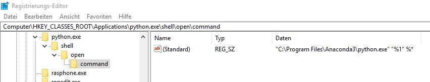

# Script to Export Inkscape Images

## Install

Add the containing folder of this script to your PATH and mark the script executable if necessary.

## Usage

```
$> LayerExport.py --help

Options:
  -h, --help            show this help message and exit
  -i FILE, --input=FILE
                        input file to process
  -o OUTDIR, --output=OUTDIR
                        output directory
  -k, --keepsvg         keep svg file
  -d DPI, --dpi=DPI     specify resolution in dpi, e.g. --dpi 90
  -v, --verbose         enable debug output

```

## Troubleshooting for Windows

If this script is in the PATH variable und does not recognize any Argument which was passed head over to the Windows Registry (run -> regedt.exe) and look for the open-with association of python.exe. It should read something like this in order to forward arguments from the command line.



Where i found this: [Stack-Overflow Thread](https://stackoverflow.com/questions/2640971/windows-is-not-passing-command-line-arguments-to-python-programs-executed-from-t)

# Contact
* [Johannes Teiwes](mailto:johannes.teiwes@me.com)
